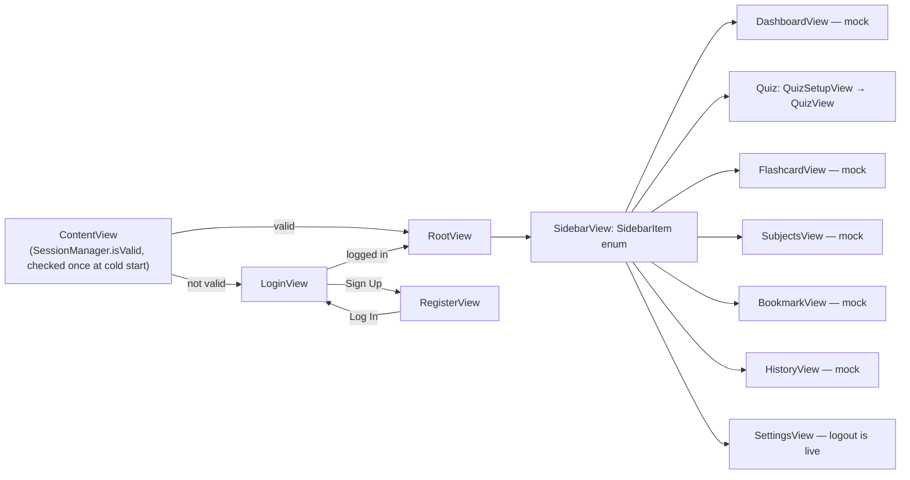
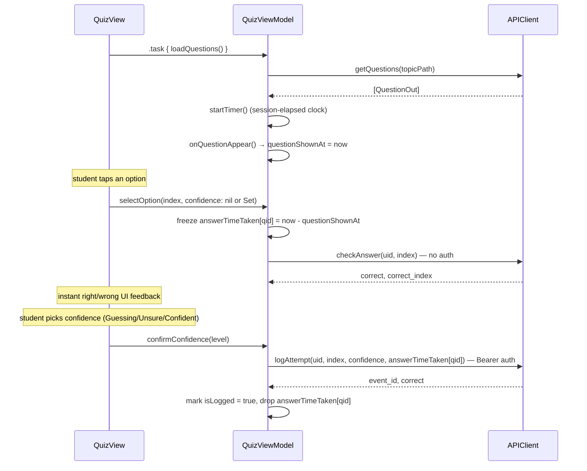

# MediQuiz — Personalized Medical Learning (iOS)

SwiftUI iPad/iPhone app for medical students to study via quizzes and flashcards, track subject mastery, and review history. Built against a companion FastAPI backend ("Student Knowledge Graph API").

- **Bundle ID:** `com.meeko.personalized-medical-learning-ios`
- **iOS deployment target:** 26.5+ (iPhone + iPad)
- **Swift:** 5.0
- **Orientation:** Landscape only (both iPhone and iPad — no portrait support)
- **Backend (dev):** `http://10.67.52.231:8000` (see [`APIClient.swift`](personalized-medical-learning-ios/APIClient.swift#L138-L140)). App Transport Security carries an explicit HTTP exception for this host — see [Setup & Configuration](#setup--configuration).

All source lives flat in [`personalized-medical-learning-ios/`](personalized-medical-learning-ios/) — no subfolders, no module boundaries. 39 Swift files.

---

## Feature status — read this first

Not everything in the app is real. Only **auth** and **quiz** talk to the backend. Everything else renders static, hardcoded data and will look interactive but does nothing when tapped.

| Feature | Status | Backend-wired | View model | Notes |
|---|---|---|---|---|
| **Auth** (login / register / logout) | Live | ✅ | `LoginViewModel`, `RegisterViewModel` | Full round-trip: register/login persist a session to Keychain; logout calls the server then clears it. |
| **Quiz** | Live | ✅ | `QuizViewModel`, `QuizSetupViewModel` | Fully wired: topic list, question fetch, answer check, confidence + timing log. See [Quiz feature deep dive](#quiz-feature-deep-dive). |
| **Dashboard** | Mock | ❌ | none | All content (`DashboardData` in `DashboardModels.swift`) is hardcoded. No buttons do anything. |
| **Flashcards** | Mock | ❌ | none | Only **one** flashcard exists (`FlashcardData.cards`, single element). Prev/next/rating buttons are no-ops. The "12 / 150" counter is decorative. |
| **Bookmarks** | Mock | ❌ | none | 6 hardcoded items (`BookmarkData.items`), filterable client-side. Bookmark-toggle button is a no-op. |
| **History** | Mock | ❌ | none | Fully hardcoded sections/entries (`HistoryData.sections`). Read-only, no interactivity at all. |
| **Subjects** | Mock | ❌ | none | 7 hardcoded subjects (`SubjectData.subjects`); only **Cardiology** has topic detail — the other 6 show an empty state. The "My Progress" tab is cosmetic (doesn't filter anything). |
| **Onboarding** | Orphaned | ❌ | none | `OnboardingView` exists and is fully built, but **nothing in the app navigates to it** — not from `ContentView`, not from `RootView`, not after register/login. Dead code as far as the running app is concerned. |
| **Settings** | Partial | ✅ (logout only) | none (logic inline in the View) | Displays real `SessionManager.studentId`; logout calls `APIClient.logoutStudent`. Error from that call is silently swallowed (`try?`) — the view has an `errorMessage` state var and UI for it that's never actually populated. |

If you're picking this up: the dashboard/flashcards/bookmarks/history/subjects screens are essentially high-fidelity static mockups. Treat them as a UI reference for what the real, wired version should look like — not as a starting point to "add a feature" to, since there's no view model or backend contract behind them yet.

---

## Architecture

**Pattern:** MVVM where a feature is backend-wired (View owns a `@StateObject` ViewModel, ViewModel owns an `APIClient` reference and exposes `@Published` state). Everywhere else, Views read directly from a static `enum ...Data` and hold only local `@State` for UI toggles — there's no view model to speak of.

**Navigation:** No `NavigationStack` / `NavigationSplitView` anywhere. [`RootView.swift`](personalized-medical-learning-ios/RootView.swift) is a single enum-driven switch:

Every screen except Quiz gets a trivial `onBack: { selection = .dashboard }` closure and manages no further navigation state at the `RootView` level. Quiz is the only case with real sub-navigation: `RootView` holds `activeTopicPath: String?` and toggles between `QuizSetupView` (topic picker) and `QuizView` (the actual quiz), passing the chosen topic path through.

**Session lifecycle:** [`ContentView.swift`](personalized-medical-learning-ios/ContentView.swift) checks `SessionManager.isValid` **once**, at `@State` initialization — it is not re-evaluated reactively while the app runs. If a token expires mid-session, the user is not automatically kicked back to the login screen; they'll only hit it on the next cold launch or explicit logout.

---

## Networking layer

### `APIClient.swift`

Single `final class APIClient` (`APIClient.shared` singleton, but also injectable via `init(session:)` for testing). Two private transport helpers:
- `get<Response: Decodable>(path:)` — unauthenticated GET, expects HTTP 200.
- `send<Body: Encodable, Response: Decodable>(path:body:expectedStatus:token:)` — POST with JSON body; adds `Authorization: Bearer <token>` header when `token` is passed.

Errors surface as `APIError` (`.server(String)`, `.decoding`, `.network(Error)`). Server-side validation errors (`APIValidationError`, FastAPI's 422 shape) are unwrapped to their first message via `makeServerError`.

Dates decode via a custom `JSONDecoder.dateDecodingStrategy` that tries fractional-seconds ISO8601 first, then falls back to whole-seconds ISO8601.

### Endpoint reference

| Method | Path | Auth | Request | Response | Client method |
|---|---|---|---|---|---|
| POST | `/students/register` | — | `StudentRegisterRequest` (full_name, student_number, academic_year) | `StudentRegisterResponse` (student_id, event_id, token, expires_at) — 201 | `registerStudent(fullName:studentNumber:academicYear:)` |
| POST | `/students/login` | — | `StudentLoginRequest` (student_number) | `SessionResponse` (student_id, token, expires_at) — 200 | `loginStudent(studentNumber:)` |
| POST | `/students/logout` | Bearer | — | 204 No Content | `logoutStudent(token:)` |
| GET | `/quiz/topics` | — | — | `TopicListResponse` (topics: [String]) | `listTopics()` |
| GET | `/quiz/topics/{topic_path}/questions` | — | — | `[QuestionOut]` (uid, stem, options, topic_tag, difficulty) | `getQuestions(topicPath:)` |
| POST | `/quiz/questions/{uid}/check` | — | `CheckAnswerRequest` (selected_index) | `CheckAnswerResponse` (correct, correct_index) — 200 | `checkAnswer(uid:selectedIndex:)` |
| POST | `/quiz/questions/{uid}/log` | Bearer | `LogAttemptRequest` (selected_index, confidence, time_taken_seconds) | `LogAttemptResponse` (event_id, correct) — 200 | `logAttempt(uid:selectedIndex:confidence:timeTakenSeconds:)` |

`/check` and `/log` are intentionally split (see [Quiz feature deep dive](#quiz-feature-deep-dive) for why) — there is no single "submit answer" endpoint.

### `SessionManager.swift` / `KeychainStore.swift`

`SessionManager` is a stateless `enum` facade over `KeychainStore` (a thin `Security` framework wrapper using `kSecClassGenericPassword`, accessible-after-first-unlock). Stores three keys: `session.token`, `session.studentId`, `session.expiresAt` (ISO8601 string). `SessionManager.isValid` = token present AND `expiresAt > Date()`. `SessionManager.start(...)` / `.end()` write/clear all three keys together.

---

## Quiz feature deep dive

The most complex and most recently built part of the app. Files: [`QuizView.swift`](personalized-medical-learning-ios/QuizView.swift), [`QuizViewModel.swift`](personalized-medical-learning-ios/QuizViewModel.swift), [`QuizHeaderView.swift`](personalized-medical-learning-ios/QuizHeaderView.swift), [`QuizSidePanelView.swift`](personalized-medical-learning-ios/QuizSidePanelView.swift), [`QuestionCardView.swift`](personalized-medical-learning-ios/QuestionCardView.swift), [`ConfidenceSelectorView.swift`](personalized-medical-learning-ios/ConfidenceSelectorView.swift), [`QuizModels.swift`](personalized-medical-learning-ios/QuizModels.swift), [`QuizSetupView.swift`](personalized-medical-learning-ios/QuizSetupView.swift), [`QuizSetupViewModel.swift`](personalized-medical-learning-ios/QuizSetupViewModel.swift), [`QuizSetupModels.swift`](personalized-medical-learning-ios/QuizSetupModels.swift).

### Setup flow

`QuizSetupView` is a 3-step wizard (`QuizSetupStep`: `.topics` → `.settings` → `.start`), backed by `QuizSetupViewModel` for step 1 only (fetches `listTopics()`, maps each server path string to a `QuizTopic` via `QuizTopic.fromServerPath(_:)`, which derives a display name from the last path segment).

Topic selection is **single-select** — the backend takes exactly one `topic_path` per question fetch, so there's no concept of a multi-topic quiz. `QuizSettings` (timer duration, review-mode toggle) is client-only cosmetic state; it is never sent to the server because the API has no concept of it.

`RootView` receives the chosen `QuizTopic` via `onStart` and stores `topic.path` as `activeTopicPath`, which is what gets passed into `QuizView(topicPath:)`.

### Taking the quiz

Key design points, since the flow isn't obvious from the code alone:

- **`/check` vs `/log` split.** `/check` is pure grading with no auth and no graph write — it exists purely so the UI can show instant right/wrong the moment an option is tapped. `/log` is the single write per question (creates one `InteractionEvent` server-side) and requires both `selected_index` and `confidence` to be known, so it's only called once — either immediately after `/check` (if confidence was already picked) or later from `confirmConfidence` (if the option was picked first). `QuizQuestion.isLogged` and the `answerTimeTaken` dictionary guard both paths against double-firing.
- **Two separate timers, don't confuse them:**
  - `elapsedSeconds` / `elapsedTimeText` — a session-wide stopwatch, starts once when questions load, ticks every second via `Timer.publish`, stops on `.onDisappear`. Rendered as a bare bold number next to the "Navigation" button in `QuizHeaderView` — **total time in the quiz, not per-question.**
  - `answerTimeTaken[questionID]` — per-question, frozen at the exact moment `selectOption` fires (question-shown → answer-selected only). Confidence-picking time is deliberately excluded. This is what's sent as `time_taken_seconds` in `/log` — it's a comprehension-speed signal, not a "how long were you on this screen" signal.
- **Next is gated on confidence.** `QuestionCardView`'s Next button is disabled until `confidenceSelection != nil` (`isNextEnabled` param, wired from `QuizView`) — a student can't skip past a question without picking a confidence level.
- **`QuizQuestion.state`** (`.correct` / `.incorrect` / `.unanswered`) is a computed property derived from `correctIndex` (set by `/check`) and `selectedIndex` — it does *not* depend on whether `/log` has fired yet, so the navigator grid and progress stats update the instant the student answers, before confidence is even picked.

### Models

`QuizModels.swift` defines the client-side `QuizQuestion`/`QuizOption`/`QuestionState`/`Difficulty` types plus `QuizQuestion.init(index:questionOut:)`, which maps the server's `QuestionOut` (uid, stem, options, topic_tag, difficulty: Int 0-2+) into the richer client model — option letters (A/B/C/D…) are derived from array position, `Difficulty` buckets the server's raw int (`<2` easy, `2` medium, `>2` hard). Fields the server doesn't provide (`explanationBody`, `xp` — XP was removed from the UI entirely) either stay empty or don't exist on the model.

`ConfidenceLevel` (in `ConfidenceSelectorView.swift`) has both a display `rawValue` ("Guessing"/"Unsure"/"Confident", used in UI text) and a separate `apiValue` (lowercase, "guessing"/"unsure"/"confident" — what actually goes over the wire). Don't conflate the two when touching this code.

---

## Auth feature

`LoginView` / `RegisterView` are simple form screens (`@StateObject` view model each, local `@State` for form fields, `.fullScreenCover` to flip between them). Both follow the same shape: validate non-empty fields client-side → disable submit button until valid → call the view model's async method → `onChange` watches a "did succeed" flag to fire the `onLogIn` closure back up to `ContentView`.

`LoginViewModel.logIn` and `RegisterViewModel.register` both call `SessionManager.start(...)` directly on success — session persistence happens inside the view model, not the view.

---

## Shared UI infrastructure

- **`Theme`** (defined in `DashboardModels.swift`, despite the name suggesting it's dashboard-specific — it's actually used app-wide): `Theme.dark`, `Theme.bg`, `Theme.card`, `Theme.mint`. Every screen in the app depends on this.
- **`SectionHeader`** (defined in `LeftColumnView.swift`): reused across dashboard columns.
- **`FlowLayout`** (in `SubjectDetailView.swift`): a custom SwiftUI `Layout` protocol implementation for wrapping chip/tag rows (used by `RelatedConceptsCard`).

---

## Known gaps / things to fix before relying on them

1. **`OnboardingView` is fully built but unreachable.** No call site anywhere navigates to it. If it's meant to run after registration, that wiring doesn't exist yet.
2. **`SettingsView` logout swallows errors.** `try? await APIClient.shared.logoutStudent(...)` — if the network call fails, the user is logged out locally anyway (session cleared regardless) and never told the server-side logout failed. The view has `errorMessage` state and UI for it that's dead code.
3. **Session validity isn't reactive.** A token expiring mid-session doesn't kick the user back to `LoginView` until next cold launch.
4. **Every mock screen has non-functional buttons.** Dashboard quick actions, flashcard rating/pagination, bookmark toggle, subject "Start Learning" — all `Button {}` no-ops. Don't assume a tap does something just because it looks tappable.
5. **`SubjectsView`'s "My Progress" tab is cosmetic** — tracked in state but never used to filter the subject list.
6. **Only Cardiology has subject topic detail** — the other 6 subjects in `SubjectData.subjects` have `topics: []`.
7. **Dev backend runs over plain HTTP** — `Info.plist` carries an ATS exception scoped to `10.67.52.231`. Don't reuse this pattern for a production host without HTTPS.

---

## Setup & Configuration

1. Open `personalized-medical-learning-ios.xcodeproj` in Xcode (targets iOS 26.5+, so a recent-enough Xcode is required).
2. Backend base URL is hardcoded at [`APIConfig.baseURL`](personalized-medical-learning-ios/APIClient.swift#L138-L140) (`http://10.67.52.231:8000`). To point at a different backend:
   - Update that URL.
   - If switching to a non-HTTPS host other than the current dev IP, also update the `NSExceptionDomains` entry in `Info.plist`, or switch to HTTPS and drop the ATS exception entirely.
3. Build & run — orientation is locked to landscape, so the simulator/device should be rotated accordingly.
4. No environment-specific build configurations or `.xcconfig` files exist yet — it's a single hardcoded URL, not a scheme-based dev/staging/prod setup.
